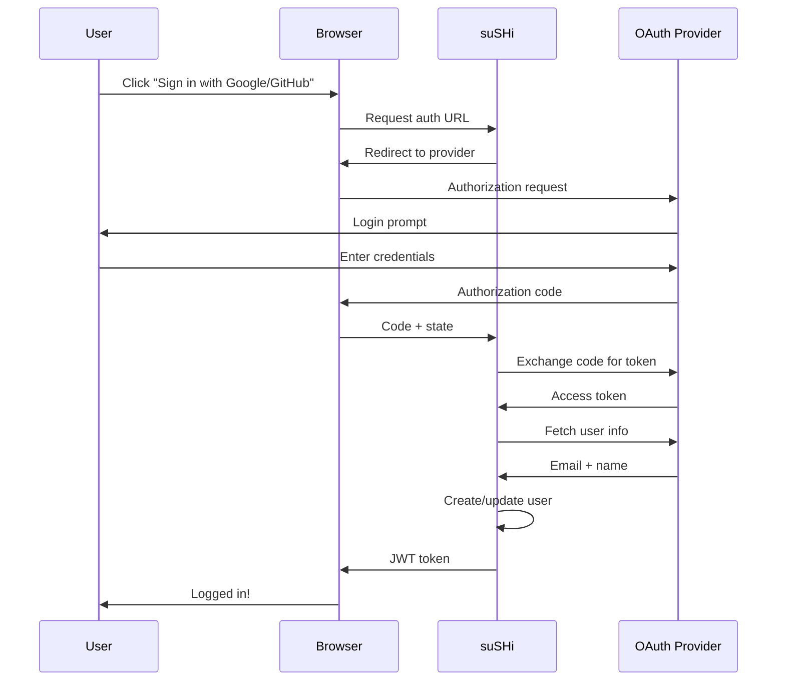

## Overview

suSHi supports OAuth 2.0 authentication with Google and GitHub, allowing you to sign in using your existing accounts without creating separate credentials.

**Benefits:**

- No password to remember
- Leverages battle-tested authentication providers
- Easy account linking and recovery
- Seamless single sign-on experience

## Supported Providers

<CardGroup cols={2}>
  <Card title="Google OAuth" icon="google">
    Sign in with your Google account (@gmail.com or Google Workspace)
  </Card>
  
  <Card title="GitHub OAuth" icon="github">
    Sign in with your GitHub account (personal or organization)
  </Card>
</CardGroup>

## How OAuth Works

suSHi implements the OAuth 2.0 authorization code flow:



<Info>
suSHi never sees your OAuth provider password. Authentication happens directly with Google or GitHub.
</Info>

## Google OAuth

### Authorization Flow

When you sign in with Google:

1. **Redirect to Google**: You're sent to Google's OAuth authorization page
2. **Permission Request**: Google asks you to authorize suSHi
3. **Callback**: Google redirects back with authorization code
4. **Token Exchange**: suSHi exchanges code for access token
5. **Fetch Profile**: suSHi retrieves your email and name
6. **Account Creation**: Your account is created or updated

### Requested Scopes

suSHi requests the following permissions:

```javascript
scopes: [
  "https://www.googleapis.com/auth/userinfo.email",
  "https://www.googleapis.com/auth/userinfo.profile"
]
```

**Why these scopes?**

- **userinfo.email**: Required to identify your account
- **userinfo.profile**: Used to display your name in the dashboard

<Note>
suSHi only requests read-only access to basic profile information. No access to Gmail, Drive, or other Google services.
</Note>

### User Information Retrieved

From Google's API:

```json
{
  "email": "user@gmail.com",
  "name": "John Doe"
}
```

This information is used to:

- Create your suSHi account (email as username)
- Display your name in the dashboard
- Associate machines with your account

### Authorization URL

Generated URL format:

```
https://accounts.google.com/o/oauth2/auth?
  client_id=YOUR_CLIENT_ID&
  redirect_uri=https://your-domain.com/auth/google/callback&
  response_type=code&
  scope=email+profile&
  state=RANDOM_STATE_STRING
```

<Accordion title="URL Parameters Explained">
  - **client_id**: Your Google OAuth app identifier
  - **redirect_uri**: Where to send users after authorization
  - **response_type**: `code` for authorization code flow
  - **scope**: Requested permissions (space-separated)
  - **state**: Random string to prevent CSRF attacks
</Accordion>

## GitHub OAuth

### Authorization Flow

When you sign in with GitHub:

1. **Redirect to GitHub**: You're sent to GitHub's OAuth authorization page
2. **Permission Request**: GitHub asks you to authorize suSHi
3. **Callback**: GitHub redirects back with authorization code
4. **Token Exchange**: suSHi exchanges code for access token
5. **Fetch Profile**: suSHi retrieves your email and username
6. **Email Verification**: If email not public, fetches from emails API
7. **Account Creation**: Your account is created or updated

### Requested Scopes

suSHi requests:

```javascript
scopes: ["user:email"]
```

**Why this scope?**

- **user:email**: Needed to access your verified email addresses
- GitHub doesn't include email in basic profile by default
- suSHi needs your email to create your account

<Info>
If your email is public on GitHub, we fetch it from your profile. Otherwise, we use the verified primary email from your account settings.
</Info>

### User Information Retrieved

From GitHub's API:

```json
// Primary API call: GET /user
{
  "name": "John Doe",
  "email": "user@example.com"  // If public
}

// Fallback API call: GET /user/emails
[
  {
    "email": "user@example.com",
    "primary": true,
    "verified": true
  }
]
```

**Email Selection Priority:**

1. Email from main profile (if public)
2. Primary verified email from emails API
3. First verified email found

<Warning>
If no verified email is found on your GitHub account, authentication will fail. Verify at least one email address in GitHub settings.
</Warning>

### Authorization URL

Generated URL format:

```
https://github.com/login/oauth/authorize?
  client_id=YOUR_CLIENT_ID&
  redirect_uri=https://your-domain.com/auth/github/callback&
  scope=user:email&
  state=RANDOM_STATE_STRING
```

## Security Features

<Tabs>
  <Tab title="State Parameter">
    The `state` parameter prevents CSRF attacks:
    
    1. suSHi generates a random state string
    2. Stores it in your session
    3. Sends it to OAuth provider
    4. Validates it on callback
    
    If the state doesn't match, the request is rejected.
    
    ```go
    // State verification on callback
    if receivedState != storedState {
        return error("Invalid state parameter")
    }
    ```
  </Tab>
  
  <Tab title="Token Exchange">
    Authorization codes are exchanged server-side:
    
    - Code is single-use and expires quickly
    - Exchange happens on suSHi server, not in browser
    - Access tokens never exposed to client
    
    ```go
    token, err := oauth2Config.Exchange(context.Background(), code)
    // Token used server-side only
    ```
  </Tab>
  
  <Tab title="HTTPS Only">
    All OAuth flows require HTTPS:
    
    - Redirect URIs must use HTTPS
    - Tokens transmitted over encrypted connections
    - Prevents man-in-the-middle attacks
    
    <Warning>
    OAuth will not work over plain HTTP in production. Local development can use HTTP with localhost.
    </Warning>
  </Tab>
  
  <Tab title="JWT Tokens">
    After OAuth succeeds, suSHi issues JWT tokens:
    
    - Short-lived session tokens
    - Stateless authentication
    - Signed with server secret
    
    These tokens are used for all subsequent API requests.
  </Tab>
</Tabs>

## Setting Up OAuth (For Self-Hosting)

If you're running your own suSHi instance, you'll need to configure OAuth:

### Google OAuth Setup

<Steps>
  <Step title="Create Project">
    Go to [Google Cloud Console](https://console.cloud.google.com/)
  </Step>
  
  <Step title="Enable OAuth">
    Navigate to **APIs & Services > Credentials**
  </Step>
  
  <Step title="Create OAuth Client">
    Click **Create Credentials > OAuth 2.0 Client ID**
  </Step>
  
  <Step title="Configure Client">
    - Application type: **Web application**
    - Authorized redirect URIs: `https://your-domain.com/auth/google/callback`
  </Step>
  
  <Step title="Get Credentials">
    Copy the **Client ID** and **Client Secret**
  </Step>
  
  <Step title="Update Config">
    Add to your suSHi configuration:
    
    ```yaml
    oauth:
      google:
        client_id: "YOUR_CLIENT_ID"
        client_secret: "YOUR_CLIENT_SECRET"
        redirect_url: "https://your-domain.com/auth/google/callback"
        scopes:
          - "https://www.googleapis.com/auth/userinfo.email"
          - "https://www.googleapis.com/auth/userinfo.profile"
        state: "RANDOM_STRING"  # Generate securely
    ```
  </Step>
</Steps>

### GitHub OAuth Setup

<Steps>
  <Step title="Developer Settings">
    Go to [GitHub Developer Settings](https://github.com/settings/developers)
  </Step>
  
  <Step title="New OAuth App">
    Click **New OAuth App**
  </Step>
  
  <Step title="Configure App">
    - Application name: **suSHi**
    - Homepage URL: `https://your-domain.com`
    - Callback URL: `https://your-domain.com/auth/github/callback`
  </Step>
  
  <Step title="Get Credentials">
    Copy the **Client ID** and generate a **Client Secret**
  </Step>
  
  <Step title="Update Config">
    Add to your suSHi configuration:
    
    ```yaml
    oauth:
      github:
        client_id: "YOUR_CLIENT_ID"
        client_secret: "YOUR_CLIENT_SECRET"
        redirect_url: "https://your-domain.com/auth/github/callback"
        scopes:
          - "user:email"
        state: "RANDOM_STRING"  # Generate securely
    ```
  </Step>
</Steps>

<Note>
The `state` parameter should be a cryptographically random string. Generate it securely and keep it secret.
</Note>

## Using OAuth in Your Application

### Initiating OAuth Flow

To start authentication:

```html
<!-- Google Sign-In Button -->
<a href="/auth/google">
  <button>Sign in with Google</button>
</a>

<!-- GitHub Sign-In Button -->
<a href="/auth/github">
  <button>Sign in with GitHub</button>
</a>
```

Backend generates the authorization URL:

```go
// Google
func GenerateGoogleAuthURL(config models.Config) string {
    params := url.Values{}
    params.Add("client_id", config.OAuthConfig.Google.ClientID)
    params.Add("redirect_uri", config.OAuthConfig.Google.RedirectURL)
    params.Add("response_type", "code")
    params.Add("scope", strings.Join(config.OAuthConfig.Google.Scopes, " "))
    params.Add("state", config.OAuthConfig.Google.State)
    
    return "https://accounts.google.com/o/oauth2/auth?" + params.Encode()
}
```

### Handling Callback

After user authorizes:

```go
// Extract authorization code
code := r.URL.Query().Get("code")
state := r.URL.Query().Get("state")

// Validate state (CSRF protection)
if state != expectedState {
    return error("Invalid state")
}

// Exchange code for token
email, name, err := HandleGoogleCallback(config, code)

// Create or update user
user := CreateOrUpdateUser(email, name)

// Issue JWT token
jwtToken := GenerateJWT(user)

// Send token to client
return jwtToken
```

## Troubleshooting

<AccordionGroup>
  <Accordion title="Redirect URI mismatch">
    **Error:** `redirect_uri_mismatch` or `The redirect URI in the request does not match`
    
    **Cause:** The redirect URI in your request doesn't match the one configured in OAuth app settings.
    
    **Solutions:**
    
    1. Verify exact match (including protocol, domain, path)
    2. Check for trailing slashes: `/callback` vs `/callback/`
    3. Ensure HTTPS in production
    4. Update OAuth app settings to match your configuration
  </Accordion>
  
  <Accordion title="Invalid state parameter">
    **Error:** `Invalid state parameter` or CSRF protection failed
    
    **Cause:** State parameter doesn't match between request and callback
    
    **Solutions:**
    
    1. Ensure state is stored in session/cookie
    2. Check for session expiry
    3. Verify state generation and validation logic
    4. Clear browser cookies and retry
  </Accordion>
  
  <Accordion title="Email not found (GitHub)">
    **Error:** No verified email found on GitHub account
    
    **Cause:** GitHub account has no verified email addresses
    
    **Solutions:**
    
    1. Go to [GitHub Email Settings](https://github.com/settings/emails)
    2. Add and verify an email address
    3. Make email public or ensure it's verified
    4. Retry authentication
  </Accordion>
  
  <Accordion title="Token exchange failed">
    **Error:** Failed to exchange code for token
    
    **Cause:** Authorization code expired or invalid credentials
    
    **Solutions:**
    
    1. Code expires quickly - complete flow faster
    2. Verify client ID and secret are correct
    3. Check OAuth app is not suspended
    4. Ensure server time is accurate (for token validation)
  </Accordion>
</AccordionGroup>

## Best Practices

<CardGroup cols={2}>
  <Card title="Use Environment Variables" icon="code">
    Never hardcode OAuth credentials. Use environment variables or secret management.
    
    ```bash
    export GOOGLE_CLIENT_ID="..."
    export GOOGLE_CLIENT_SECRET="..."
    ```
  </Card>
  
  <Card title="Rotate Secrets Regularly" icon="rotate">
    Periodically regenerate OAuth client secrets for security.
  </Card>
  
  <Card title="Monitor OAuth Usage" icon="chart-line">
    Track authentication failures and suspicious patterns in logs.
  </Card>
  
  <Card title="Implement Rate Limiting" icon="gauge">
    Prevent brute force attacks on OAuth endpoints with rate limiting.
  </Card>
</CardGroup>

## Next Steps

<CardGroup cols={2}>
  <Card title="Security" icon="shield" href="/features/security">
    Learn about security measures in suSHi
  </Card>
  
  <Card title="Machine Management" icon="server" href="/features/machine-management">
    Start adding your SSH machines
  </Card>
</CardGroup>