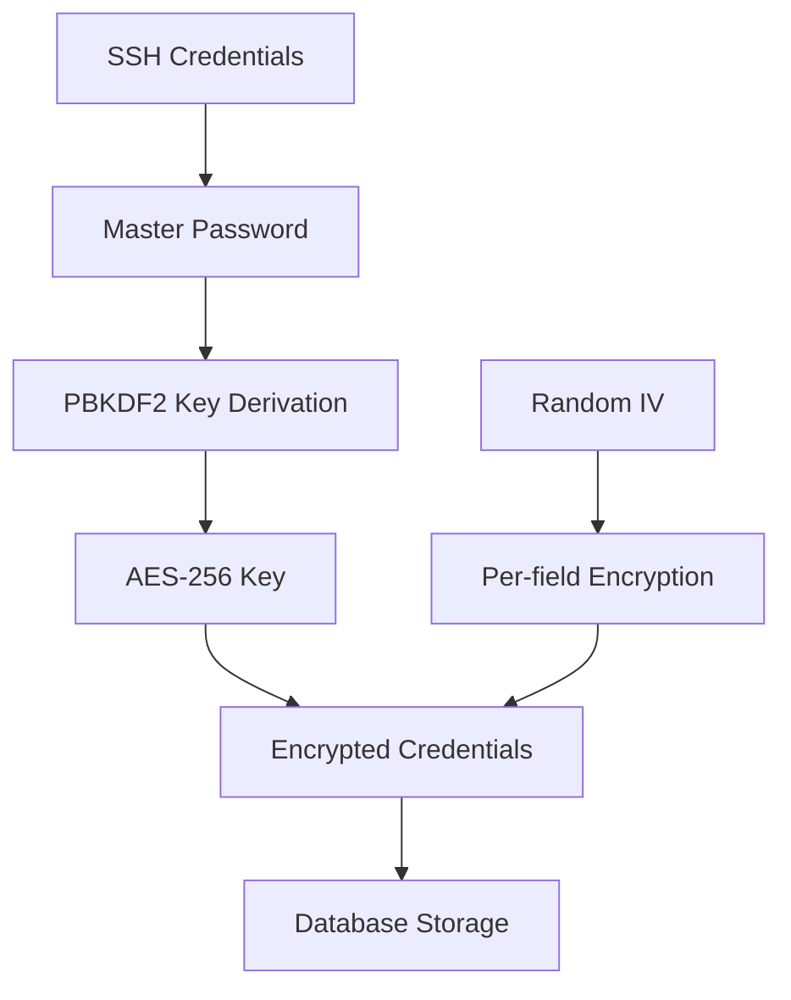
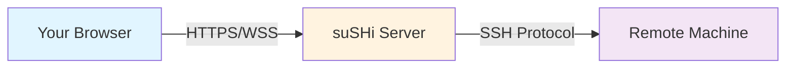

## Overview

suSHi takes security seriously. All sensitive credentials are encrypted at rest, authentication is handled securely, and connections use industry-standard encryption protocols.

**Core Security Principles:**

- **Encryption at Rest**: All credentials encrypted with AES-256
- **Zero Knowledge**: Your master password is never stored
- **Secure Transmission**: All connections use TLS/SSL
- **Minimal Privileges**: Access controls based on JWT authentication

## Encryption Architecture

suSHi uses a multi-layered encryption approach:



## Credential Encryption

### What Gets Encrypted

The following sensitive data is encrypted before storage:

<CardGroup cols={2}>
  <Card title="Private Keys" icon="key">
    SSH private key content (RSA, ECDSA, Ed25519)
  </Card>
  
  <Card title="Passphrases" icon="lock">
    Private key passphrases for encrypted keys
  </Card>
</CardGroup>

<Info>
**Not encrypted:** Machine names, hostnames, ports, usernames, and organization names. These are considered non-sensitive metadata.
</Info>

### Encryption Algorithm

suSHi uses **AES-256-CFB** (Advanced Encryption Standard, 256-bit, Cipher Feedback mode):

```go
// Encryption implementation
func EncryptString(text, password, salt string) (string, string, error) {
    // 1. Derive 256-bit key from password using PBKDF2
    key := pbkdf2.Key(
        []byte(password),
        []byte(salt),
        10000,      // Iterations
        32,         // Key length (256 bits)
        sha256.New  // Hash function
    )
    
    // 2. Create AES cipher block
    block, err := aes.NewCipher(key)
    
    // 3. Generate random IV (Initialization Vector)
    iv := make([]byte, aes.BlockSize)
    rand.Read(iv)
    
    // 4. Encrypt using CFB mode
    ciphertext := make([]byte, len(text))
    stream := cipher.NewCFBEncrypter(block, iv)
    stream.XORKeyStream(ciphertext, []byte(text))
    
    // 5. Encode to base64 for storage
    encodedCiphertext := base64.StdEncoding.EncodeToString(ciphertext)
    encodedIV := base64.StdEncoding.EncodeToString(iv)
    
    return encodedCiphertext, encodedIV, nil
}
```

<Accordion title="Why These Choices?">
  **AES-256**: Industry-standard symmetric encryption, proven secure
  
  **CFB Mode**: Stream cipher mode, works well with variable-length data
  
  **PBKDF2**: Password-based key derivation, slows down brute force attacks
  
  **Random IV**: Each encrypted value uses unique IV, prevents pattern recognition
  
  **Base64 Encoding**: Safe text encoding for database storage
</Accordion>

### Key Derivation with PBKDF2

PBKDF2 (Password-Based Key Derivation Function 2) converts your master password into an encryption key:

**Parameters:**

- **Password**: Your master password (provided at connection time)
- **Salt**: Unique per-user salt (stored in database)
- **Iterations**: 10,000 rounds
- **Key Length**: 32 bytes (256 bits)
- **Hash Function**: SHA-256

**Why 10,000 iterations?**

Each iteration makes brute force attacks slower. 10,000 is a balance between:

- **Security**: Slows down attackers significantly
- **Performance**: Fast enough for real-time decryption
- **Compatibility**: Well-tested iteration count

<Warning>
Increasing iterations improves security but slows down encryption/decryption. 10,000 is currently recommended by security standards.
</Warning>

### Initialization Vectors (IV)

Each encrypted field gets a unique, random IV:

```go
// Generate random IV
iv := make([]byte, aes.BlockSize)  // 16 bytes
rand.Read(iv)                      // Cryptographically secure randomness
```

**Why IVs matter:**

- Encrypting the same data twice produces different ciphertext
- Prevents pattern analysis attacks
- Each private key and passphrase has its own IV

**Storage:**

```json
{
  "private_key": "base64_encrypted_data",
  "iv_private_key": "base64_iv",
  "passphrase": "base64_encrypted_data",
  "iv_passphrase": "base64_iv"
}
```

## Decryption Process

When you connect to a machine:

<Steps>
  <Step title="Request Connection">
    You click Connect on a machine in the dashboard
  </Step>
  
  <Step title="Enter Master Password">
    You provide your master password (used for decryption)
  </Step>
  
  <Step title="Fetch Encrypted Data">
    Server retrieves encrypted private key, passphrase, and IVs from database
  </Step>
  
  <Step title="Derive Decryption Key">
    PBKDF2 derives key from your password and stored salt
  </Step>
  
  <Step title="Decrypt Credentials">
    AES-256-CFB decrypts the private key and passphrase using derived key and IVs
  </Step>
  
  <Step title="Establish SSH Connection">
    Decrypted credentials used to connect to remote machine
  </Step>
  
  <Step title="Discard Plaintext">
    Decrypted credentials exist only in memory during connection, never stored
  </Step>
</Steps>

```go
// Decryption implementation
func DecryptString(encodedCiphertext, encodedIV, password, salt string) (string, error) {
    // 1. Decode base64
    ciphertext, _ := base64.StdEncoding.DecodeString(encodedCiphertext)
    iv, _ := base64.StdEncoding.DecodeString(encodedIV)
    
    // 2. Derive key (same as encryption)
    key := pbkdf2.Key(
        []byte(password),
        []byte(salt),
        10000,
        32,
        sha256.New
    )
    
    // 3. Create cipher
    block, _ := aes.NewCipher(key)
    
    // 4. Decrypt
    plaintext := make([]byte, len(ciphertext))
    stream := cipher.NewCFBDecrypter(block, iv)
    stream.XORKeyStream(plaintext, ciphertext)
    
    return string(plaintext), nil
}
```

<Info>
Decryption only happens when you explicitly connect to a machine. Credentials are never decrypted for listing or viewing machines.
</Info>

## Password Security

### Master Password

Your master password is critical for security:

<Tabs>
  <Tab title="Never Stored">
    suSHi **never stores** your master password anywhere:
    
    - Not in database
    - Not in logs
    - Not in session storage
    - Not in cookies
    
    You must enter it each time you connect to a machine.
  </Tab>
  
  <Tab title="Per-Connection">
    You provide your master password:
    
    - When connecting to machines
    - For decrypting stored credentials
    - Validated by successful decryption
    
    If the password is wrong, decryption fails and connection aborted.
  </Tab>
  
  <Tab title="Strong Passwords">
    Choose a strong master password:
    
    - **Length**: At least 12 characters
    - **Complexity**: Mix of uppercase, lowercase, numbers, symbols
    - **Uniqueness**: Don't reuse from other services
    - **Memorable**: You'll need to type it often
    
    Consider using a password manager to generate and store it.
  </Tab>
  
  <Tab title="Salt Storage">
    Each user has a unique salt:
    
    - Generated on account creation
    - Stored in database (not secret)
    - Used in PBKDF2 key derivation
    - Makes rainbow table attacks infeasible
  </Tab>
</Tabs>

<Warning>
**Lost password = lost access**

If you forget your master password, there's no recovery mechanism. Your encrypted credentials cannot be decrypted. You'll need to delete and re-add your machines with new credentials.
</Warning>

### Password Best Practices

<CardGroup cols={2}>
  <Card title="Use Password Manager" icon="vault">
    Store your master password in a reputable password manager like 1Password, Bitwarden, or LastPass.
  </Card>
  
  <Card title="Enable 2FA on OAuth" icon="mobile">
    Use two-factor authentication on your Google/GitHub accounts for additional security.
  </Card>
  
  <Card title="Rotate Regularly" icon="arrows-rotate">
    Change your master password periodically (every 3-6 months).
  </Card>
  
  <Card title="Unique Per Service" icon="fingerprint">
    Don't reuse your master password on any other service.
  </Card>
</CardGroup>

## Authentication Security

### JWT Tokens

After OAuth login, suSHi issues JWT (JSON Web Tokens):

```json
{
  "header": {
    "alg": "HS256",
    "typ": "JWT"
  },
  "payload": {
    "username": "user@example.com",
    "exp": 1234567890,
    "iat": 1234564290
  },
  "signature": "..."
}
```

**Token Properties:**

- **Stateless**: No server-side session storage
- **Signed**: HMAC-SHA256 signature prevents tampering
- **Expiring**: Tokens expire after set duration
- **Bearer**: Sent in `Authorization: Bearer <token>` header

<Info>
JWT tokens are signed with a server secret. Tampering with the token invalidates the signature, causing authentication to fail.
</Info>

### Authorization Checks

Every API request validates:

1. **JWT Validity**: Token signature and expiration
2. **User Extraction**: Username from token payload
3. **Ownership**: User owns the requested resource

```go
// Example authorization check
func GetMachine(config Config, w http.ResponseWriter, r *http.Request) {
    // Extract username from JWT
    username, err := utils.GetUsernameFromToken(r)
    if err != nil {
        return http.StatusUnauthorized
    }
    
    // Fetch machine with ownership check
    machine, err := database.GetAMachine(config, machineID, username, "user")
    if err != nil {
        return http.StatusNotFound  // Not found or not authorized
    }
    
    // Return machine
    return machine
}
```

<Warning>
You can only access machines you own. Cross-user access is prevented by database queries that filter by owner.
</Warning>

## Connection Security

### TLS/SSL Encryption

All connections to suSHi use TLS 1.2+ encryption:

<Tabs>
  <Tab title="HTTPS">
    Web dashboard and API:
    
    - Encrypted with TLS 1.2 or higher
    - Certificate validation
    - Forward secrecy (ECDHE key exchange)
  </Tab>
  
  <Tab title="WSS (WebSocket Secure)">
    Terminal connections:
    
    - WebSocket over TLS
    - Same encryption as HTTPS
    - Real-time terminal I/O encrypted
  </Tab>
  
  <Tab title="SSH">
    Machine connections:
    
    - Standard SSH protocol
    - Public key or password authentication
    - End-to-end encrypted tunnels
  </Tab>
</Tabs>

### Network Security



All three connection segments are encrypted:

1. **Browser ↔ suSHi**: TLS 1.2+ (HTTPS/WSS)
2. **suSHi ↔ Machine**: SSH protocol encryption
3. **End-to-end**: No plaintext transmission at any point

## Database Security

### Encrypted Fields

Credential storage in database:

```sql
-- Example machine record
CREATE TABLE machines (
    id INT PRIMARY KEY,
    name VARCHAR(255),              -- Plaintext
    hostname VARCHAR(255),          -- Plaintext
    port VARCHAR(10),               -- Plaintext
    username VARCHAR(255),          -- Plaintext
    private_key TEXT,               -- ENCRYPTED
    iv_private_key VARCHAR(255),    -- IV for private_key
    passphrase TEXT,                -- ENCRYPTED
    iv_passphrase VARCHAR(255),     -- IV for passphrase
    owner_id VARCHAR(255),          -- Plaintext (username/email)
    owner_type VARCHAR(50)          -- Plaintext ('user' or 'org')
);
```

### Access Controls

- **Database Credentials**: Stored in environment variables, never in code
- **Connection Pooling**: Limited concurrent connections
- **Prepared Statements**: Prevents SQL injection
- **Row-level Security**: Queries filter by owner

## Threat Model & Mitigations

<AccordionGroup>
  <Accordion title="Database Compromise">
    **Threat:** Attacker gains access to database
    
    **Impact:** Attacker gets encrypted credentials but cannot decrypt without master passwords
    
    **Mitigation:**
    - All sensitive data encrypted at rest
    - Master passwords never stored
    - PBKDF2 slows brute force attacks
    - Unique salt per user
  </Accordion>
  
  <Accordion title="Man-in-the-Middle (MITM)">
    **Threat:** Attacker intercepts network traffic
    
    **Impact:** Cannot decrypt TLS-encrypted traffic
    
    **Mitigation:**
    - All connections use TLS 1.2+
    - Certificate validation enforced
    - HSTS headers recommended
    - No plaintext transmission
  </Accordion>
  
  <Accordion title="Session Hijacking">
    **Threat:** Attacker steals JWT token
    
    **Impact:** Temporary access until token expires
    
    **Mitigation:**
    - Short-lived tokens (configurable)
    - Secure cookie flags (HttpOnly, Secure)
    - Token rotation on sensitive operations
    - IP-based anomaly detection (recommended)
  </Accordion>
  
  <Accordion title="Brute Force Attacks">
    **Threat:** Attacker tries many passwords
    
    **Impact:** Limited by PBKDF2 iterations and rate limiting
    
    **Mitigation:**
    - PBKDF2 with 10,000 iterations
    - Rate limiting on authentication endpoints
    - Account lockout after failed attempts
    - Captcha on login (recommended)
  </Accordion>
  
  <Accordion title="Insider Threats">
    **Threat:** Malicious administrator
    
    **Impact:** Cannot decrypt credentials without master passwords
    
    **Mitigation:**
    - Zero-knowledge architecture
    - Audit logging of all operations
    - Multi-person access controls
    - Regular security audits
  </Accordion>
</AccordionGroup>

## Security Best Practices

### For Users

<Steps>
  <Step title="Strong Master Password">
    Choose a strong, unique password for encrypting your credentials
  </Step>
  
  <Step title="Enable 2FA">
    Enable two-factor authentication on your OAuth provider accounts
  </Step>
  
  <Step title="Use SSH Keys">
    Prefer SSH keys over passwords for machine authentication
  </Step>
  
  <Step title="Rotate Credentials">
    Regularly update SSH keys and passwords on your machines
  </Step>
  
  <Step title="Log Out">
    Always log out when done, especially on shared computers
  </Step>
  
  <Step title="Monitor Access">
    Review access logs periodically for suspicious activity
  </Step>
</Steps>

### For Administrators

<CardGroup cols={2}>
  <Card title="Keep Updated" icon="cloud-arrow-down">
    Regularly update suSHi to get security patches
  </Card>
  
  <Card title="Secure Database" icon="database">
    Use strong database passwords and restrict network access
  </Card>
  
  <Card title="Enable Logging" icon="file-lines">
    Log all authentication and access attempts
  </Card>
  
  <Card title="Backup Encrypted" icon="hard-drive">
    Encrypt database backups and store securely
  </Card>
  
  <Card title="Rate Limiting" icon="gauge">
    Implement rate limiting on all public endpoints
  </Card>
  
  <Card title="Network Isolation" icon="network-wired">
    Run suSHi in isolated network with firewall rules
  </Card>
</CardGroup>

## Compliance & Standards

suSHi's security measures align with:

- **OWASP Top 10**: Protections against common web vulnerabilities
- **NIST Guidelines**: Password storage and key derivation
- **PCI DSS**: Encryption at rest and in transit (where applicable)
- **GDPR**: User data protection and privacy

<Info>
For compliance documentation or security audit reports, contact your suSHi administrator or vendor.
</Info>

## Reporting Security Issues

If you discover a security vulnerability:

1. **Do not** open a public GitHub issue
2. Email security concerns to the maintainers privately
3. Provide detailed reproduction steps
4. Allow reasonable time for fixes before disclosure

<Warning>
Responsible disclosure helps protect all users. Please report security issues privately.
</Warning>

## Security Roadmap

Planned security enhancements:

- [ ] Hardware security module (HSM) integration
- [ ] Certificate pinning for mobile apps
- [ ] Audit log dashboard
- [ ] IP allowlisting per machine
- [ ] Biometric authentication options
- [ ] Zero-trust architecture components

## Next Steps

<CardGroup cols={2}>
  <Card title="OAuth Authentication" icon="right-to-bracket" href="/features/oauth-authentication">
    Learn how to sign in securely with Google or GitHub
  </Card>
  
  <Card title="Machine Management" icon="server" href="/features/machine-management">
    Understand how credentials are stored when adding machines
  </Card>
</CardGroup>