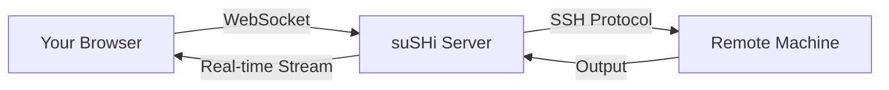

## Overview

suSHi provides a fully-featured web-based SSH terminal that runs directly in your browser. Built with xterm.js and WebSocket technology, it offers a native terminal experience without requiring any local SSH client installation.

## How It Works

The web terminal establishes a secure connection between your browser and remote machines:

1. **WebSocket Connection**: Your browser connects to the suSHi server via WebSocket
2. **SSH Bridge**: The server maintains an SSH connection to your target machine
3. **Real-time Data**: Commands and output are streamed bidirectionally in real-time



## Key Features

<Tabs>
  <Tab title="Multi-Tab Support">
    Open multiple terminal sessions in different tabs within the same browser window:
    
    - Click the **+** button in the tab bar to open new terminals
    - Switch between terminals instantly
    - Each tab maintains its own independent SSH session
    - All tabs share the same WebSocket connection for efficiency
    
    <Info>
    Each terminal tab creates its own SSH session, allowing you to work on multiple tasks simultaneously on the same or different machines.
    </Info>
  </Tab>
  
  <Tab title="Pseudo Terminal (PTY)">
    Full pseudo-terminal support with:
    
    - **Terminal Type**: xterm emulation
    - **Size**: 600 rows × 800 columns
    - **Echo**: Enabled for interactive input
    - **Speed**: 14400 baud (input/output)
    
    This enables full support for interactive applications like:
    - Text editors (vim, nano)
    - Interactive shells (bash, zsh)
    - Terminal UI applications (htop, less)
  </Tab>
  
  <Tab title="Session Management">
    Automatic session handling:
    
    - **Connection Pooling**: Reuses SSH connections efficiently
    - **Heartbeat Mechanism**: Keeps connections alive with periodic pings
    - **Auto-cleanup**: Closes inactive sessions automatically
    - **UUID Tracking**: Each session gets a unique identifier
    
    <Warning>
    Sessions are automatically cleaned up after periods of inactivity. Save your work regularly to prevent data loss.
    </Warning>
  </Tab>
</Tabs>

## Using the Terminal

### Accessing a Machine

1. Navigate to your machine list in the dashboard
2. Click **Connect** on the machine you want to access
3. Enter your encryption password when prompted
4. The terminal opens automatically in a new tab

### Terminal Interface

The terminal interface includes:

- **Tab Bar**: Shows all open terminal sessions
- **Terminal Area**: Full-screen terminal emulator
- **Add Tab Button (+)**: Opens additional terminal sessions

<Note>
The terminal automatically connects on load using the UUID from your connection request. No manual configuration needed!
</Note>

### Working with Multiple Tabs

```javascript
// Terminal tabs are managed client-side
// Each tab maintains:
{
  tabId: 0,           // Unique tab identifier
  terminal: Terminal, // xterm.js instance
  ws: WebSocket      // WebSocket connection
}
```

### Connection Flow

<Steps>
  <Step title="Connect to Machine">
    Click the Connect button on a machine in your dashboard
  </Step>
  
  <Step title="Authenticate">
    Enter your encryption password to decrypt stored credentials
  </Step>
  
  <Step title="Session Created">
    Server creates SSH connection and generates a unique UUID
  </Step>
  
  <Step title="Terminal Opens">
    Browser redirects to terminal page with UUID parameter
  </Step>
  
  <Step title="WebSocket Established">
    Terminal establishes WebSocket connection using the UUID
  </Step>
  
  <Step title="Start Working">
    Full SSH terminal access with real-time command execution
  </Step>
</Steps>

## Technical Details

### WebSocket Protocol

The terminal uses a custom message format for WebSocket communication:

```json
{
  "type": "data",        // Message type: 'data' or 'heartbeat'
  "data": "ls -la\n"     // Terminal input/output content
}
```

**Message Types:**

- **`data`**: Terminal commands and output
- **`heartbeat`**: Keep-alive ping sent every 5 minutes

### Connection URL

Terminals connect to WebSocket endpoint:

```javascript
wss://your-domain.com/ssh?uuid=<session-uuid>
```

<Accordion title="Connection Parameters">
  - **Protocol**: WSS (WebSocket Secure)
  - **Endpoint**: `/ssh`
  - **Query Parameter**: `uuid` (session identifier)
  - **Authentication**: JWT token (handled automatically)
</Accordion>

### Heartbeat Mechanism

To keep connections alive and track active sessions:

```javascript
// Heartbeat sent every 5 minutes
setInterval(() => {
  if (ws.readyState === WebSocket.OPEN) {
    ws.send(JSON.stringify({ 
      type: 'heartbeat', 
      data: '' 
    }));
  }
}, 5 * 60 * 1000);
```

Server-side processing:
- Updates session activity timestamp
- Tracks usage for time-bucket analytics
- Prevents connection timeouts

<Info>
Heartbeats are rounded to the nearest minute for efficient time-bucket tracking and session management.
</Info>

## Browser Support

The web terminal works in all modern browsers that support:

- WebSocket API
- ES6 JavaScript
- HTML5 Canvas (for xterm.js rendering)

**Recommended browsers:**
- Chrome/Edge 90+
- Firefox 88+
- Safari 14+

## Best Practices

<CardGroup cols={2}>
  <Card title="Save Work Frequently" icon="floppy-disk">
    Don't rely on browser tabs staying open. Save your work to prevent loss from accidental closures.
  </Card>
  
  <Card title="Use Screen/Tmux" icon="window-restore">
    For long-running tasks, use terminal multiplexers like `screen` or `tmux` to persist sessions.
  </Card>
  
  <Card title="Mind the Bandwidth" icon="gauge-high">
    Real-time streaming uses bandwidth. Avoid very large outputs or consider pagination.
  </Card>
  
  <Card title="Secure Your Session" icon="lock">
    Always log out when done. Don't leave terminals open on shared or public computers.
  </Card>
</CardGroup>

## Limitations

<Warning>
**Current Limitations:**

- File uploads/downloads require SCP or SFTP commands
- Terminal size is fixed (600×800) - not responsive to window resize
- No built-in clipboard integration (use browser clipboard)
- Session timeout after extended inactivity
</Warning>

## Troubleshooting

<AccordionGroup>
  <Accordion title="Terminal won't connect">
    **Possible causes:**
    - Invalid or expired UUID
    - SSH connection to machine failed
    - WebSocket connection blocked by firewall
    
    **Solutions:**
    - Try reconnecting from the machine dashboard
    - Check machine credentials and network accessibility
    - Verify WebSocket traffic (WSS) isn't blocked
  </Accordion>
  
  <Accordion title="Commands lag or timeout">
    **Possible causes:**
    - Network latency to remote machine
    - Server under heavy load
    - Remote machine is slow to respond
    
    **Solutions:**
    - Check your internet connection
    - Verify the remote machine is responsive
    - Consider using a closer geographic region
  </Accordion>
  
  <Accordion title="Terminal displays garbled characters">
    **Possible causes:**
    - Character encoding mismatch
    - Terminal type not supported by remote
    
    **Solutions:**
    - Ensure remote machine supports xterm
    - Set proper locale: `export LANG=en_US.UTF-8`
    - Check terminal emulation settings
  </Accordion>
</AccordionGroup>

## Next Steps

<CardGroup cols={2}>
  <Card title="Machine Management" icon="server" href="/features/machine-management">
    Learn how to add and manage your SSH machines
  </Card>
  
  <Card title="Security" icon="shield" href="/features/security">
    Understand how your credentials are protected
  </Card>
</CardGroup>